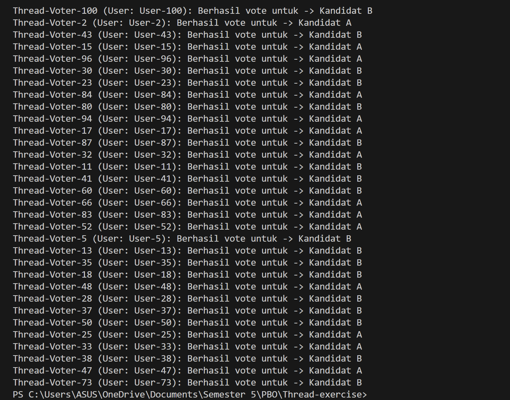

``Pinka Dima Calista``
``F1D02310087``

Program ini adalah simulasi sederhana dari sistem voting online yang dirancang untuk mendemonstrasikan bagaimana Java menangani banyak permintaan data ke database secara bersamaan (concurrency).

Saat program berjalan, kita tidak memproses 100 vote secara berurutan, melainkan melepaskan semuanya hampir pada saat yang sama. Ini menghasilkan race condition yang terkontrol, di mana semua pekerja berlomba menggunakan resource yang sama.
- Voter = Thread: Setiap voter diwakili oleh sebuah objek Thread. Kita membuat 100 thread dan menjalankannya menggunakan .start().
- Tugas = Setiap thread diberi objek tugas (VoteTask) yang mengimplementasikan Runnable. Objek ini mengenkapsulasi data vote (ID & Pilihan) dan logika koneksi database (JDBC).
- Database MariaDB/MySQL (tabel_voting) berfungsi sebagai Shared Resource. Semua thread secara independen membuka koneksi dan menjalankan query insert ke tabel ini.

Hasil Akhir :
Output di konsol akan terlihat acak atau menunjukkan thread berjalan bebas, hasil akhirnya adalah 100 baris data yang berhasil tercatat di database, membuktikan bahwa aplikasi mampu menangani lonjakan beban (spike load) dengan baik menggunakan multithreading.

# Thread-exercise